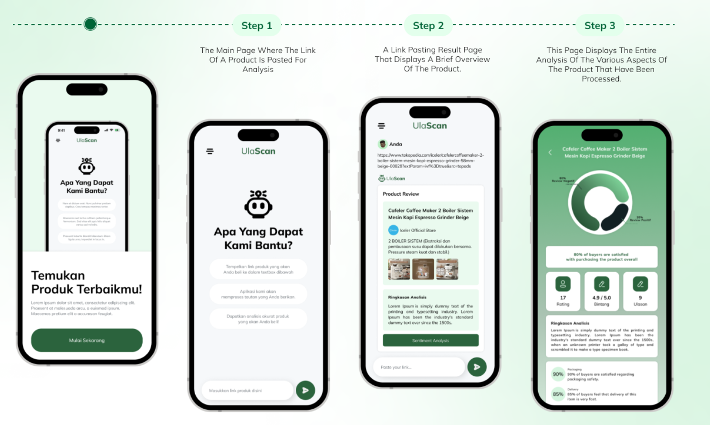

# UlaScan Android Application Capstone Project

This is an android project for the capstone project of UlaScan. The project is a mobile application that allows users to find sentimental analysis of a product on Tokopedia by providing links to the product.

## Application Flow


## Features


Here are detailed break down of the features:
1. **Login Page**: Users can login to the application using their email.
2. **Register Page**: Users can create their own account for our application by filling their full name, email, and password.
3. **Onboarding Page**: Users can see what they should expect on our app!
4. **Chat Page**: Users can do find the analysis of their desired product with sentiment analysis.
5. **Detail Page**: User can see the detail of the product analysis, including how much the product is loved, percentage of admin response, etc.

## Frameworks and Libraries
There are several frameworks and libraries used in this project:
1. **Jetpack Compose**: Jetpack Compose is Android’s modern toolkit for building native UI. It simplifies and accelerates UI development on Android.

2. **Retofit2**: Retrofit is a type-safe HTTP client for Android and Java.

3. **DataStore**: DataStore is a data storage solution that allows you to store key-value pairs or typed objects with protocol buffers.
4. **Paging 3**: The Paging library helps you load and display pages of data from a larger dataset from local storage or over network.

5. **Compose Navigation**: Navigation is a library that can be used to navigate between composables. We even tried to use type-safe navigation with this library.


## What you will find

In this repository, you will find the following characteristics:
- [x] Clean Code
- [x] Clean Architecture
- [x] Implementation of MVVM Architecture
- [x] SOLID Principles

## How to run the project
1. Clone this repository
```
git clone https://github.com/Ulas-Scan/UlaScan_MD.git
```
2. Open the project in Android Studio
3. Build the project
4. Run the project

